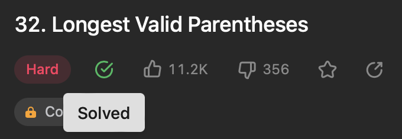
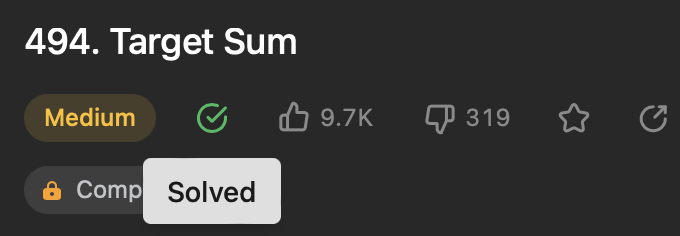
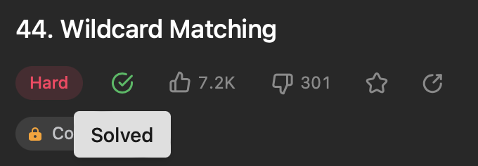

# NomedoProjeto

**Conteúdo da Disciplina**: PD 

## Alunos

| Matrícula  | Aluno                        |
| ---------- | ---------------------------- |
| 19/0016663 | Lucas Pimentel Quintão       |
| 20/0017519 | Eurico Menezes de Abreu Neto |

## Sobre

Para este projeto da disciplina optamos por fazer questões de Programação Competitiva de diferentes dificuldades, utilizando os sites CodeForces e LeetCode. As questões escolhidas foram:

- 300 - [Longest Increasing Subsequence](https://leetcode.com/problems/longest-increasing-subsequence/)
- 32 - [Longest Valid Parentheses](https://leetcode.com/problems/longest-valid-parentheses/description/)
- 494 - [Target Sum](https://leetcode.com/problems/target-sum/description/)
- 44 - [Wildcard Matching](https://leetcode.com/problems/wildcard-matching/description/)
- 416 - [Partition Equal Subset Sum](https://leetcode.com/problems/partition-equal-subset-sum/description/)

## Screenshots

### Accepteds

## Instalação

**Linguagem**: C++

Para executar os códigos rode os seguintes comandos:

<code>g++ nomeArquivo.cpp -std=c++11 -o exec</code>

<code>./exec</code>

## Uso

Para testar os exercícios, recomendamos acessar a página do exercício que deseja executar e observar os padrões dos casos de testes disponíveis.

## Outros

Quaisquer outras informações sobre seu projeto podem ser descritas abaixo.
